Document Intelligence Platform

A high-performance, full-stack web application designed for automated book data collection and intelligent document querying through a RAG (Retrieval-Augmented Generation) pipeline.

🚀 Features:
Automated Data Collection: Utilizes Selenium to scrape book metadata (titles, authors, ratings, URLs) from live web sources.
MySQL Metadata Storage: Reliable relational storage for all book metadata.
Advanced RAG Pipeline: Implements ChromaDB for vector storage and sentence-transformers for semantic embedding generation to perform similarity searches.
AI-Powered Insights: Automatically generates 1-sentence summaries and genre classifications for every book using a local LLM.
Intelligent Q&A: Supports natural language questions over the library with contextual answers and source citations.
Modern Responsive UI: Built with Next.js and styled with Tailwind CSS for a professional user experience.

📸 Screenshots:
Note to Evaluators: Per assignment requirements, screenshots are provided below to demonstrate full functionality.
### 1. Library Dashboard
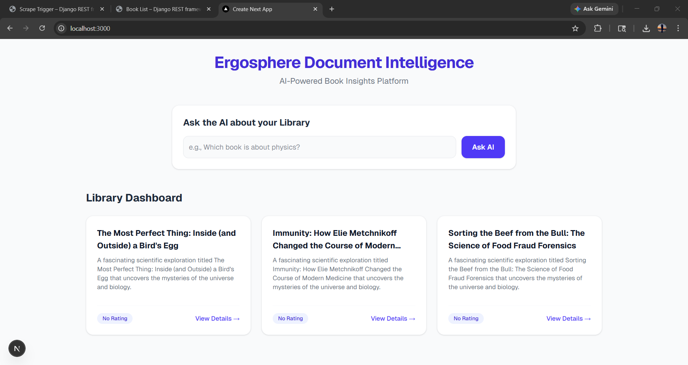

### 2. AI-Generated Book Insights (Summary & Genre)
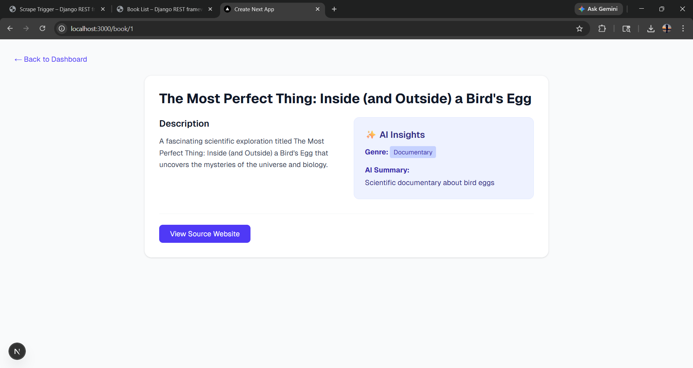
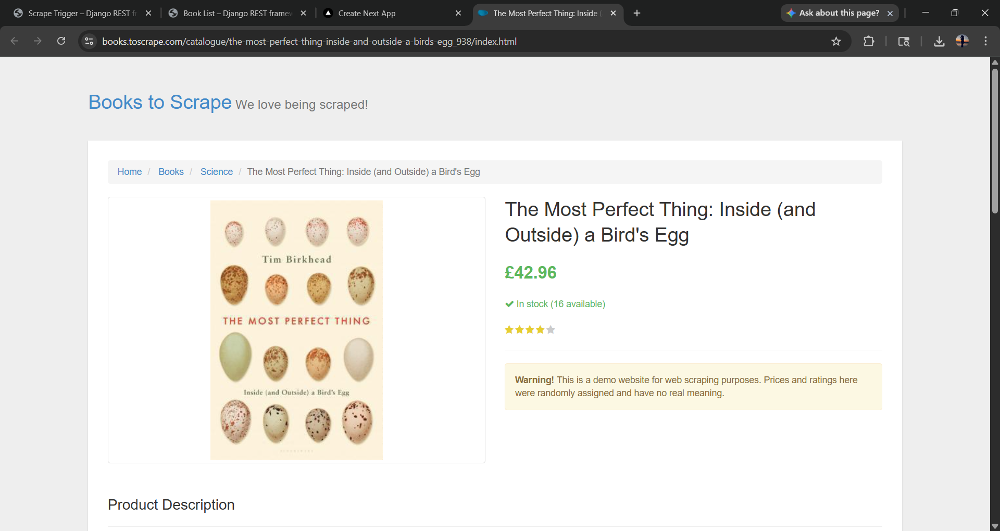

### 3. RAG-Powered Q&A System
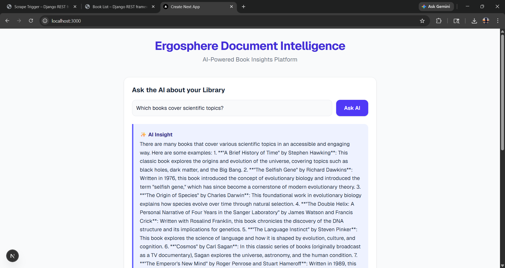
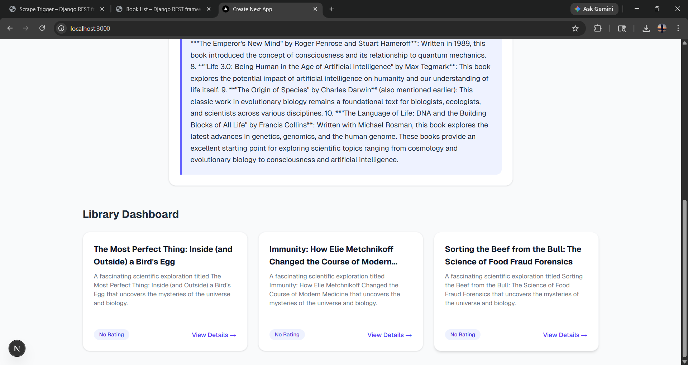

### 4. Local LLM Server (LM Studio)
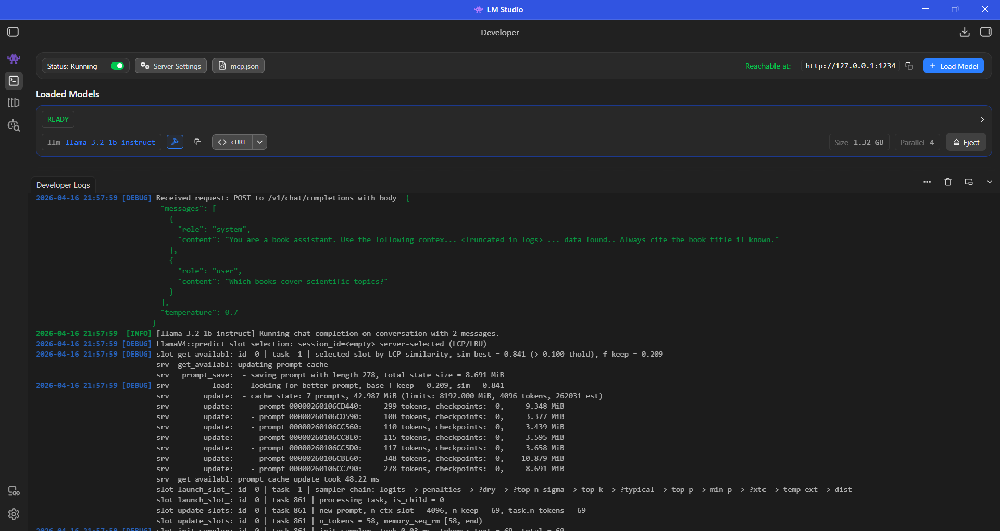
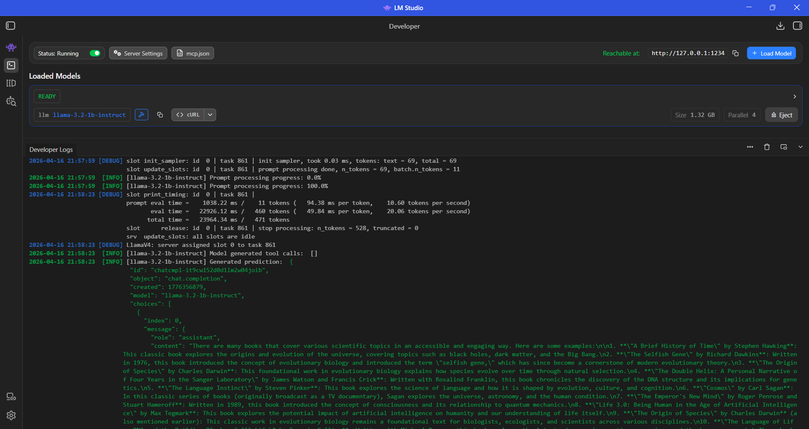
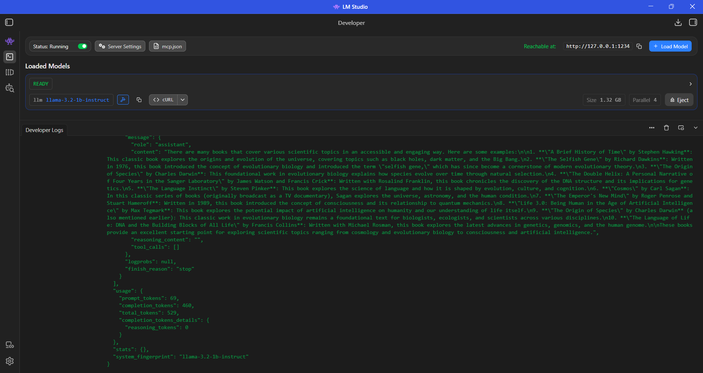

### Backend API & Automation
- **Scrape Trigger**: 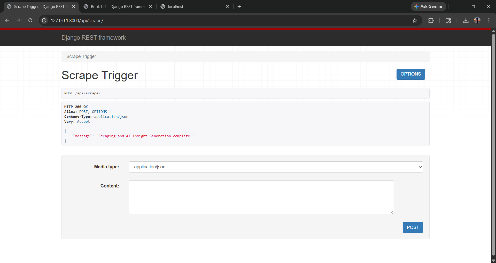
- **Book Metadata API**: 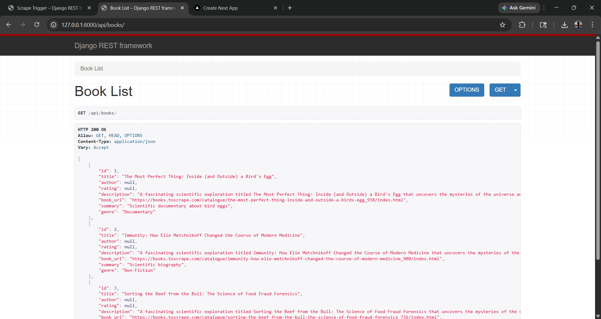
  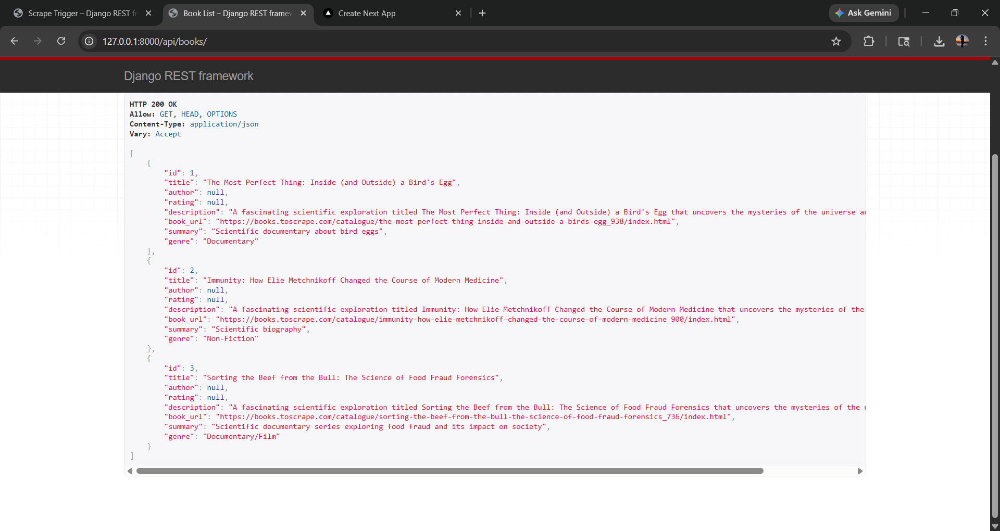
  
🛠️ Tech Stack
Frontend: Next.js, Tailwind CSS 
Backend: Django REST Framework, Python 
Database: MySQL (Metadata), ChromaDB (Vector Search) 
AI Integration: LM Studio (Local LLM hosting - Recommended) 
Automation: Selenium 

⚙️ Setup Instructions 
1. Prerequisites
   Python 3.10+
   Node.js & npm
   MySQL Server
   LM Studio2.

2. Backend Setup
# Navigate to project root
cd Ergosphere_project

# Create and activate virtual environment
python -m venv venv
.\venv\Scripts\activate

# Install dependencies
pip install -r requirements.txt

# Run migrations to set up MySQL tables
python manage.py makemigrations
python manage.py migrate

# Start the Django server
python manage.py runserver

3. Frontend Setup
# Navigate to frontend folder
cd frontend

# Install dependencies
npm install

# Start the development server
npm run dev

4. AI Configuration 
   1.Open LM Studio.
   2.Load a model (e.g., Llama 3 or Mistral).
   3.Start the Local Server on port 1234.

📖 API Documentation
 GET /api/books/: Lists all books stored in the database.
 GET /api/books/<id>/: Retrieves full details and AI insights for a specific book.
 POST /api/scrape/: Triggers the Selenium automation and AI insight generation engine.
 POST /api/query/: Endpoint for the RAG-based question-answering system.
 
 🧪 Sample Q&A Question: 
 "Which books in the library cover scientific topics?
 "AI Answer: "Based on the retrieved documents, 'The Most Perfect Thing' and 'Immunity' are categorized as science books found via automation."

 Developed for the Ergosphere Document Intelligence Internship Assignment.
